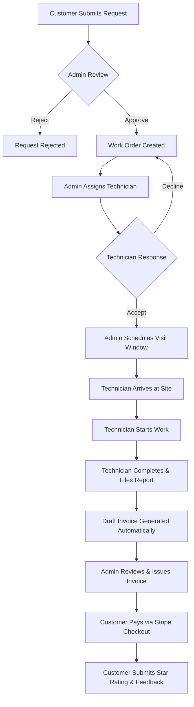
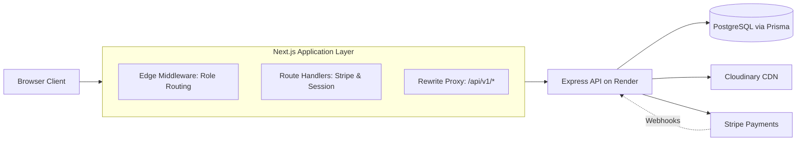

# Field Service Management Platform

Modern, full-stack responsive web application designed for on-demand field service dispatching, technician operations, customer appointment tracking, and billing workflows.

[](https://nextjs.org/)
[](https://www.typescriptlang.org/)
[](https://tailwindcss.com/)
[](https://tanstack.com/query)
[](https://stripe.com/)

---

## Live Demo

| Service | Endpoint / URL |
|---|---|
| Frontend (Vercel) | `_Add your Vercel URL here after deployment_` |
| Backend API | https://field-service-d24g.onrender.com |
| Backend repository | https://github.com/Fahim7600/Field_Service |
| Frontend repository | https://github.com/Fahim7600/Field_Service_Forntend |

> Note: The backend runs on a free Render instance. The first request after inactivity can take up to a minute while it wakes up.

---

## Demo Accounts

| Role | Email | Password | Lands on |
|---|---|---|---|
| ADMIN | `systemadmin@gmail.com` | `SystemAdminPass123` | `/admin` |
| CUSTOMER | `test_runner_cust_1791224075987@test.com` | `Password123!` | `/customer` |
| TECHNICIAN | `test_runner_tech_1791224075987@test.com` | `Password123!` | `/technician` |

Demo credentials for evaluation only. They are also available as one-click buttons on the login page.

**Stripe Test Payment Cards**:
- Successful Charge: `4242 4242 4242 4242` (any future MM/YY, any 3-digit CVC, any postal code)
- Declined Charge: `4000 0000 0000 0002`

---

## Screenshots

Add PNG files named `home.png`, `customer.png`, `dispatch.png`, `technician.png`, `payment.png`, `admin.png` into `docs/screenshots/`.

| View | Screenshot Preview | Status |
|---|---|---|
| Home Landing | `docs/screenshots/home.png` | _To be added_ |
| Customer Dashboard | `docs/screenshots/customer.png` | _To be added_ |
| Dispatch Board | `docs/screenshots/dispatch.png` | _To be added_ |
| Technician Task | `docs/screenshots/technician.png` | _To be added_ |
| Invoice and Payment | `docs/screenshots/payment.png` | _To be added_ |
| Admin Dashboard | `docs/screenshots/admin.png` | _To be added_ |

---

## Table of Contents

- [Overview](#overview)
- [Key Features](#key-features)
- [How It Works](#how-it-works)
- [Architecture](#architecture)
- [Tech Stack](#tech-stack)
- [Project Structure](#project-structure)
- [Getting Started](#getting-started)
- [Available Scripts](#available-scripts)
- [Deployment](#deployment)
- [Manual Test Checklist](#manual-test-checklist)
- [Quality and Security](#quality-and-security)
- [Known Limitations](#known-limitations)
- [Documentation](#documentation)
- [Author](#author)

---

## Overview

Field Service provides an end-to-end operational platform connecting customers needing repairs, dispatchers orchestrating staff, and mobile technicians completing work in the field. Built with modern App Router patterns, it handles real-time status progression, multi-step photo uploads, live Stripe payments, customer ratings, and comprehensive audit logs.

---

## Key Features

### Customer Portal
- Interactive booking wizard with service category selection, address entry, preferred time windows, and multi-file photo uploads.
- Real-time request tracking with multi-stage progress steppers and live status polling.
- Self-service cancellation and reschedule requests with transparent 24-hour late fee policy calculation.
- Digital invoice review and instant online checkout via Stripe payment sessions.
- VIP Premium subscription purchasing with automatic 45-second webhook activation polling.
- In-app notification center with deep links to invoices, requests, and payment updates.
- Post-service star rating and written reviews with duplicate submission conflict guards.

### Technician Workspace
- Task queue with single-status filter chips highlighting urgent responses and daily appointments.
- Task assignment acceptance and decline workflows with mandatory reason capture.
- Standardized execution stepper: Scheduled to Arrived to In Progress to Completed.
- Comprehensive digital service reports with labor hours, parts consumed, and completion photo uploads.
- Mobile-optimized agenda calendar displaying 7-day, 30-day, and all-time visit schedules.
- Performance console computing on-time arrival rate, hours logged, and completed task volumes.

### Admin Command Center
- Real-time dispatch board managing incoming requests with SLA priority and review countdowns.
- Request review workflow with one-click work order creation or rejection with audit logging.
- Technician assignment matching certified skills against category requirements with schedule conflict checks.
- Comprehensive billing console: draft invoice adjustment, issuance, cancellation, and Stripe refunds.
- VIP Premium subscriptions ledger tracking active, past-due, and cancelled auto-renewals.
- Staff and customer administration: user role promotion, status suspensions, and soft deletion.
- Service catalog management for categories and skills, plus audit logs with field deltas.
- Real-time operational dashboard with 6 isolated KPI telemetry cards and Recharts status charts.

---

## How It Works

### Core Operational Lifecycle



### Free vs. Premium Service Tiers

| Benefit | Free Tier | Premium Tier |
|---|---|---|
| Review Target SLA | 24 hours | 2 hours (Priority review) |
| Labor Discount | None | 10% automatic labor discount |
| Cancellation / Reschedule | Free until 24h before visit ($5.00 late fee within 24h) | Free until technician arrives (No late fees) |
| Booking Queue | Standard | High Priority Tag |

---

## Architecture

### System Flow Diagram



- **Authentication Model**: Short-lived access tokens reside purely in client memory. Silent token refresh occurs via an httpOnly cookie over same-origin proxy rewrites. Routing cookies (`fs_role`, `fs_hint`, `fs_must_change`) guide Edge navigation without exposing secrets.
- **Data Fetching**: Client requests use TanStack Query with background focus revalidation. All paginated endpoints pass through `normalizePaginated` to tolerate varying backend envelope shapes.
- **State Management**: Zustand handles user authentication state exclusively. Form state is managed by React Hook Form, and server caches are governed by TanStack Query.
- **Validation**: Strict runtime validation powered by React Hook Form and Zod schemas across all inputs.
- **Currency & Finance**: All currency amounts are stored and calculated strictly as integer cents to eliminate floating-point rounding errors.

---

## Tech Stack

| Area | Technology |
|---|---|
| Framework | Next.js 15 (App Router with Turbopack) |
| Language | TypeScript 5 (Strict Mode) |
| Styling | Tailwind CSS v4 & Lucide Icons |
| Component Primitives | Base UI (shadcn/ui primitives) |
| Server State | TanStack Query v5 |
| Client State | Zustand v5 |
| Forms & Validation | React Hook Form & Zod |
| HTTP Client | Axios & Native Fetch |
| Analytics & Charts | Recharts (Dynamic SSR-disabled import) |
| Linter & Formatter | Biome |

---

## Project Structure

```text
Field_Service_Forntend/
├── docs/                 # OpenAPI specification and engineering reference notes
│   ├── ENGINEERING_NOTES.md
│   ├── openapi.json
│   └── screenshots/      # Application screenshot artifacts
├── public/               # Static assets, branding, and icons
├── scripts/              # Verification scripts (check-links, check-contrast)
├── src/
│   ├── app/              # Next.js App Router (pages, layouts, route handlers, error boundaries)
│   ├── components/       # UI primitives, dashboard widgets, and domain forms
│   ├── constants/        # Site metadata, demo accounts, navigation links, and policies
│   ├── hooks/            # Custom hooks (useAuth, useLogin, useUrlFilters, useDebounce)
│   ├── lib/              # Environment helpers, formatters, safe-redirect, and API clients
│   ├── providers/        # Context wrappers (AuthProvider, QueryProvider, ThemeProvider)
│   ├── services/         # Domain API services (auth, finance, etc.)
│   ├── stores/           # Zustand stores (auth-store)
│   ├── types/            # TypeScript schemas, models, and API interfaces
│   └── middleware.ts     # Next.js Edge Middleware for role protection
├── .env.example          # Environment variables template
├── biome.json            # Biome linting and formatting configuration
├── next.config.ts        # Next.js configuration, security headers, and proxy rewrites
├── package.json          # Package manifest and npm scripts
└── tsconfig.json         # Strict TypeScript compiler configuration
```

---

## Getting Started

### Prerequisites
- Node.js >= 20.0.0
- npm >= 10.0.0

### Setup Instructions

1. Clone repository:
   ```bash
   git clone https://github.com/Fahim7600/Field_Service_Forntend.git
   cd Field_Service_Forntend
   ```

2. Install dependencies:
   ```bash
   npm install
   ```

3. Configure environment:
   ```bash
   cp .env.example .env.local
   ```

### Environment Variables

| Variable | Required | Description | Example |
|---|:---:|---|---|
| `BACKEND_URL` | Yes | Target backend API origin for proxy rewrites | `https://field-service-d24g.onrender.com` |
| `NEXT_PUBLIC_API_BASE` | Yes | API base prefix used by client requests | `/api/v1` |
| `NEXT_PUBLIC_APP_URL` | Yes | Canonical public URL of the frontend | `http://localhost:3000` |
| `NEXT_PUBLIC_CONTACT_EMAIL` | No | Public customer support contact email | `support@fieldservice.com` |
| `NEXT_PUBLIC_CONTACT_PHONE` | No | Public telephone number | `+1 (555) 019-2834` |
| `NEXT_PUBLIC_CONTACT_ADDRESS` | No | Public street address | `100 Industrial Parkway, Suite 400` |
| `NEXT_PUBLIC_CONTACT_HOURS` | No | Operating business hours | `Mon - Sat: 7:00 AM - 7:00 PM` |
| `NEXT_PUBLIC_DEMO_ADMIN_EMAIL` | No | Admin demo login button email | `systemadmin@gmail.com` |
| `NEXT_PUBLIC_DEMO_ADMIN_PASSWORD` | No | Admin demo login button password | `SystemAdminPass123` |
| `NEXT_PUBLIC_DEMO_CUSTOMER_EMAIL` | No | Customer demo login button email | `test_runner_cust_1791224075987@test.com` |
| `NEXT_PUBLIC_DEMO_CUSTOMER_PASSWORD` | No | Customer demo login button password | `Password123!` |
| `NEXT_PUBLIC_DEMO_TECHNICIAN_EMAIL` | No | Technician demo login button email | `test_runner_tech_1791224075987@test.com` |
| `NEXT_PUBLIC_DEMO_TECHNICIAN_PASSWORD` | No | Technician demo login button password | `Password123!` |

4. Run locally:
   ```bash
   npm run dev
   ```

5. Build for production:
   ```bash
   npm run build
   npm run start
   ```

---

## Available Scripts

| Script | Command | Purpose |
|---|---|---|
| `dev` | `next dev --turbopack` | Starts development server with Turbopack |
| `build` | `next build --turbopack` | Generates compiled production bundle |
| `start` | `next start` | Runs the built production server |
| `lint` | `biome check .` | Runs Biome code diagnostics without writing changes |
| `format` | `biome format --write .` | Formats source files with Biome |
| `fix` | `biome check --write .` | Applies automated linting and formatting fixes |
| `typecheck` | `tsc --noEmit` | Runs strict TypeScript type diagnostics |
| `check:links` | `node scripts/check-links.mjs` | Audits physical App Router pages against sidebar links |
| `check:contrast` | `node scripts/check-contrast.mjs` | Tests design token pairs against WCAG AA standards |
| `verify` | `npm run fix && npm run typecheck && npm run check:links && npm run check:contrast` | Runs complete quality and validation suite |

---

## Deployment

### Vercel Deployment Steps
1. Import repository on [Vercel](https://vercel.com).
2. Framework Preset will auto-detect as **Next.js**.
3. Configure Environment Variables according to the table above.
4. Deploy application.

### Backend Alignment on Render
Configure the following environment variables on the Render backend to point to your Vercel deployment URL:
- `FRONTEND_URL`: `https://<your-app>.vercel.app`
- `PUBLIC_API_URL`: `https://<your-app>.vercel.app`

### Stripe Webhook Configuration
- Webhook URL: `https://field-service-d24g.onrender.com/api/v1/payments/webhook`
- Subscribed Events:
  - `checkout.session.completed`
  - `invoice.paid`
  - `invoice.payment_failed`
  - `customer.subscription.updated`
  - `customer.subscription.deleted`

### Post-Deployment Verification
- Check health status endpoint: `https://<your-app>.vercel.app/api/health` returns `{ "status": "ok" }`.
- Test authentication with one-click demo accounts on `/login`.
- Verify Stripe test checkout flow on an unpaid customer invoice.

---

## Manual Test Checklist

| Flow Area | Action | Expected Result |
|---|---|---|
| Authentication | Click demo button on login | Authenticates into memory, syncs cookies, routes to correct home |
| Role Guard | Customer visits `/admin` | Edge middleware redirects to `/customer?role_redirect=1` |
| Service Booking | Customer submits wizard | Creates request, uploads photos, transitions status to Submitted |
| Dispatch Review | Admin approves request | Creates linked Work Order in Approved status |
| Task Assignment | Admin assigns technician | Matches skills, verifies schedule, transitions status to Assigned |
| Technician Work | Technician accepts & advances | Advances status: Scheduled to Arrived to In Progress to Completed |
| Service Report | Technician files report | Saves labor & parts, uploads completion photos, auto-generates invoice |
| Invoicing & Pay | Customer pays issued invoice | Opens Stripe Checkout, interceptor returns to success page on payment |
| VIP Premium | Customer buys membership | Redirects to Stripe, returns and activates VIP status within 45 seconds |
| Feedback | Customer reviews paid job | Records star rating and comment, prevents duplicate reviews |

---

## Quality and Security

- **Strict Type Safety**: `tsc --noEmit` runs with strict mode enabled; `any` types are avoided.
- **Code Standards**: Biome enforces consistent formatting, import order, and linting rules.
- **Accessibility**: Includes skip navigation links, semantic landmarks, and a contrast audit script verifying WCAG AA standards.
- **Security Headers**: Enforces strict CSP frame-ancestors, X-Frame-Options, X-Content-Type-Options, and Referrer-Policy.
- **Token Hygiene**: Tokens never exist in cookies or local storage; only transient in-memory stores are used.
- **Safe Redirection**: Redirection paths are strictly validated through `getSafeRedirect` to prevent open redirect vulnerabilities.
- **Repository Safety**: Scanned for secrets, tokens, private keys, and environment files.

---

## Known Limitations

- **Free-Tier Cold Starts**: Backend runs on Render's free tier and requires up to 60 seconds to spin up on cold requests.
- **Stripe Test Mode**: Online payments and recurring subscriptions run strictly in Stripe test mode.
- **Local Feedback Cache**: Work order feedback ratings are retained locally to preserve UI state when read endpoints are unavailable.
- **Contact Inquiries**: Contact form launches the visitor's default email client rather than dispatching server emails directly.
- **Payload Normalization**: The live API returns envelopes richer than the OpenAPI specification, handled gracefully via `normalizePaginated`.

---

## Documentation

- [Technical Engineering Notes](docs/ENGINEERING_NOTES.md)
- [Backend OpenAPI 3.0 Specification](docs/openapi.json)

---

## Author

Maintained by [@Fahim7600](https://github.com/Fahim7600).
